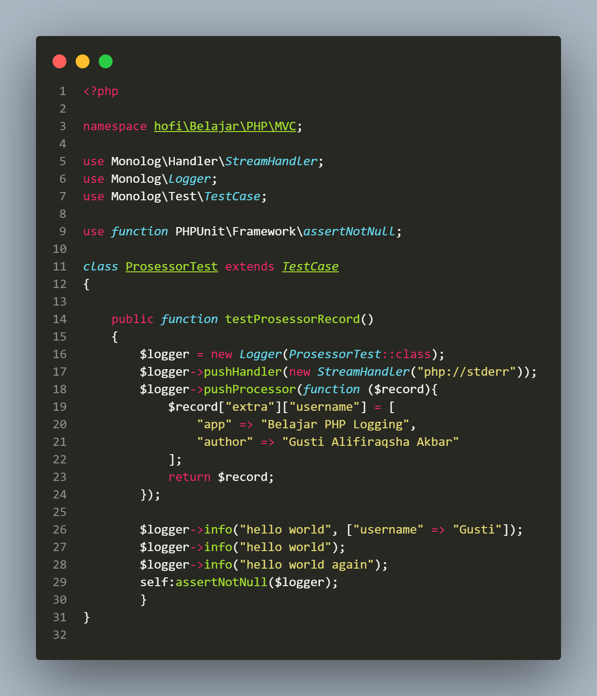
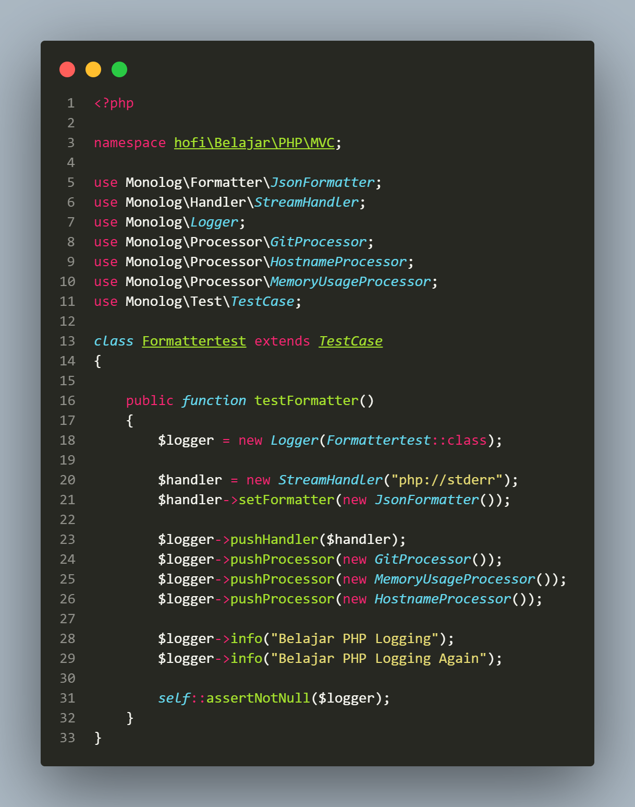
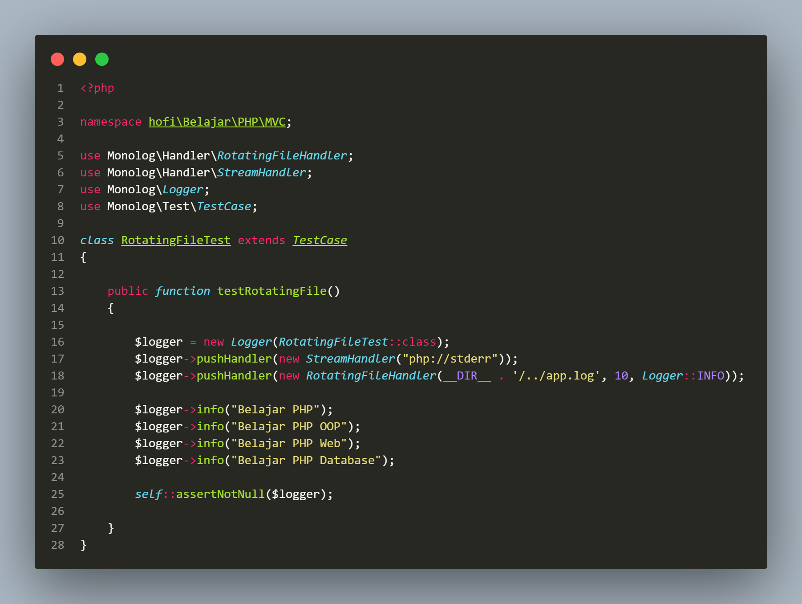

# PHP LOGGING

## A. POINT UTAMA

### 1. Pengenalan Logging

- Log file yang berisikan informasi kejadian dari sebuah sistem.

- Biasanya berisi tentang informasi waktu kejadian dan pesan kejadian.

- Bukannya hanya menampilkan informasi, kadang juga digunakan untuk proses _debugging_ ketika terjadi masalah pada aplikasi kita.

- PHP juga memiliki _function_ yang dikhususkan untuk melakukan `logging`.

- Namun sangat jarang digunakan dikarenakan penggunaannya yang kurang _fleksible_ dan fitur yang sederhana.

- Diagram Ekosistem `Logging`

  

- Logging library:

  1. Monolog, adalah _library_ `logging` untuk PHP yang paling populer.

---

### 2. Logger

- adalah sebuah _class_ yang digunakan untuk melakukan `logging`.

- Gunakan nama `logger` yang diinginkan di parameter `costructor` nya.

  

- Kode membuat `logger` dengan nama _class_ nya

  

---

### 3. Handler

- `Handler` adalah fitur didalam _monolog_ yang bertugas mengirim aktivitas _log event_ yang dikirim ke `logger` ke target yang dituju.

- `Handler` di _monolog_ direpresentasikan dalam _interface_ `HandlerInterface`.

- Kita perlu mengimplementasi _class_ `HandlerInterface`.

- Dan `StreamHandler` adalah salah satu `handler` yang sering digunakan. Dan bisa digunakan untuk mengirim _log event_ ke _file_ atau _console_.

- Kode menambahkan `handler`

  

---

### 4. Logging

- Setelah melakukan `logger` dan menambhakan `handler` ke `logger`, kita bisa mulai melakukan `logging`.

- Kode melakukan `logging`

  

---

### 5. Level

- `Monolog` mendukung banyak `level log`, dimana setiap level memiliki tingkat kepentingan yang berbeda-beda, seperti _debug_, _info_, _error_, dll.

- Saat menggunakan `stream handler`, secara default semua _log_ akan dikirimkan ke targetnya, namun kita dapat menentukan `level` mana yang ingin ditampilkan.

- Berikut daftar level

  

- Kode level

  

- Kelebihan menggunakan `StreamHandler` adalah bisa menentukan mulai level mana `log event` harus dikirim.

- Kode `streamHandler` level

  

---

### 6. Context

- `Context` adalah informasi `log event` berupa _array_.

- Cukup kirim data `context` berupa _array_ pada parameter kedua _method_ `logging` nya.

- Kode `context`

  

---

### 7. Prosessor

- `Prosessor` merupakan cara lain jika ingim menambahkan informasi ke `log event`.

- Dengan `prosessor` kita bisa menambahkan informasi tambahan pada `log event` yang dikirim.

- Gunakan `Callable` atau membuat _class_ turunan dari `prosessorInterface`.

- Kode `prosessor`

  

Monolog prosessor

- `Monolog` juga memiliki _class_ implementasi dari `prosessor interface`.

- Ini bisa digunakan untuk menambahkan informasi secara umum ke semua `log event` yang dibuat.

- Kode monolog prosessor

  

---

### 8. Reset Handler & Prosessor

- Metode `reset()` dapat digunakan pada `logger` untuk melakukan reset terhadap semua handler dan processor yang digunakan.

- Kode reset method di logger

  

---

### 9. Formatter

- Setiap `handler` biasanya memiliki default `Formatter`, contohnya `StreamHandler` menggunakan `LineFormatter`.

- Jika ingin membuat `Formatter` sendiri, bisa menggunakan _class_ turunan dari `FormatterInterface`.

- Kode monolog formatter

  

---

### 10. Rotating File Handler

- Saat menggunakan file sebagai media menyimpan log, semakin lama ukuran file akan semakin besar.

- Untungnya _class_ turunan dari `StreamHandler` bernama `RotatingFileHandler`.

- _Class_ ini bagus untuk memastikan ukuran log tidak terlalu besar, dan mudah menghapus log lama yang sudah tidak digunakan.

- Kode rotating file handler

  

---

## B. PERTANYAAN & CATATAN TAMBAHAN

- Apakah penggunaan `RotatingFileHandler` bisa seberpengaruh itu terhapat kinerja aplikasi yang dibuat?

---

## C. KESIMPULAN

- Logging dalam PHP sangat penting untuk memantau kinerja dan debug aplikasi web. Dengan logging, Anda dapat merekam pesan, kesalahan, dan aktivitas lainnya yang terjadi saat aplikasi berjalan.
